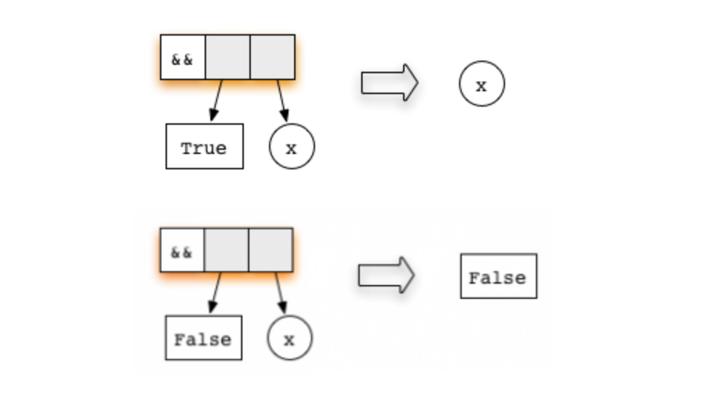
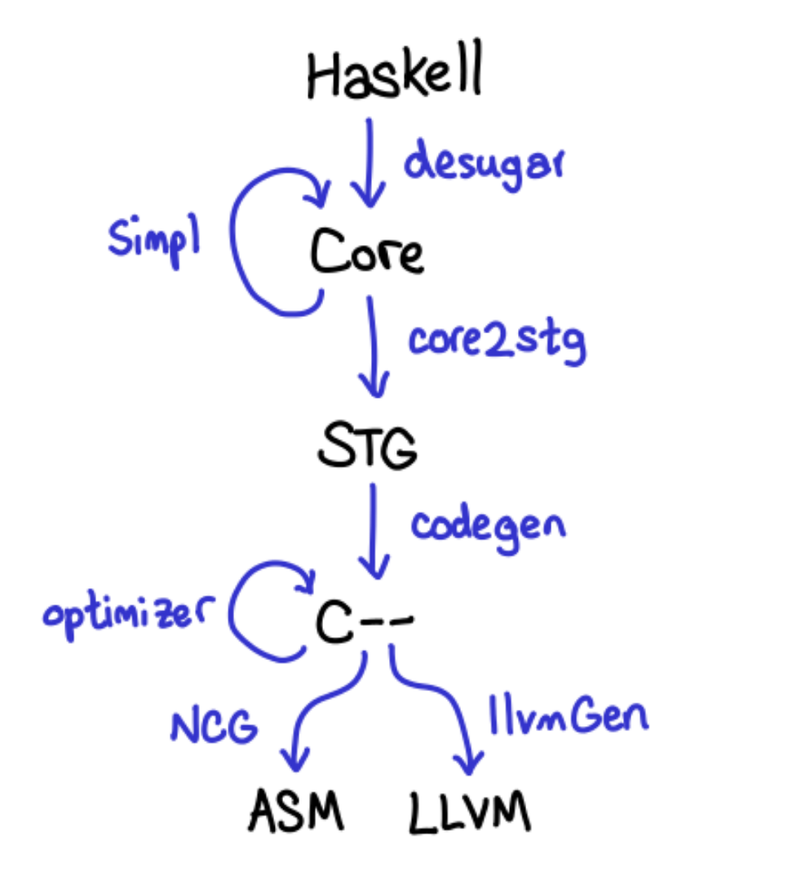

# Talk Notes: Lazy Evaluation in Haskell

Date: 24.11.2017

```c
#include <stdio.h>

int add(int x, int y) {
  return x + y;
}

int main() {
  int five = add(1 + 1, 1 + 2);
  int seven = add(1 + 2, 1 + 3);

  printf("Five: %d\n", five);
  return 0;
}
```

Our function `add` is *strict* in both of its arguments. And its result is also strict. This means that:

- Before `add` is called the first time, we will compute the result of both `1 + 1` and `1 + 2`.
- We will call the `add` function on `2` and `3`, get a result of `5`, and place that value in memory pointed at by the variable `five`.
- Then we'll do the same thing with `1 + 2`, `1 + 3`, and placing `7` in `seven`.
- Then we'll call `printf` with our `five` value, which is already fully computed.


---

```haskell
add :: Int -> Int -> Int
add x y = x + y

main :: IO ()
main = do
  let five = add (1 + 1) (1 + 2)
      seven = add (1 + 2) (1 + 3)

  putStrLn $ "Five: " ++ show five
```

- Instead of immediately computing 1 + 1 and 1 + 2, the compiler will create a *thunk* (which you can think of as a *promise*) for those computations, and pass those thunks to the add function.
- Except: we won't call the add function right away either: five will be a thunk representing the application of the add function to the thunk for 1 + 1 and 1 + 2.
- We'll end up doing the same thing with seven: it will be a thunk for applying add to two other thunks.
- When we finally try to print out the value five, we need to know the actual number. This is called *forcing evaluation*. We'll get into more detail on when and how this happens below, but for now, suffice it to say that when putStrLn is executed, it forces evaluation of five, which forces evaluation of 1 + 1 and 1 + 2, converting the thunks into real values (2, 3, and ultimately 5).
- Because seven is never used, it remains a thunk, and we don't spend time evaluating it.

---

```
λ let x = 1 + 2 :: Int
λ :sprint x
x = _
```


```
λ x
3
λ :sprint x
x = 3
```

---

```
λ let x = 1 + 2 :: Int
λ let y = x + 1
λ :sprint x
x = _
λ :sprint y
y = _
```


---


`y` depends on `x`

- ```
  λ seq y ()
  ()
  λ :sprint x
  x = 3
  λ :sprint y
  y = 4
  ```

- Defining an expression causes a thunk to be built representing that expression.

- A thunk remains unevaluated until its value is required. Once evaluated, the thunk is replaced by its value.

- ```
  seq :: a -> b -> b
  ```

---

```
λ let x = 1 + 2 :: Int
λ let z = (x,x)
λ :sprint z
z = (_,_)
```


---

```
λ import Data.Tuple
λ let z = swap (x,x+1)
λ -- swap (a,b) = (b,a)
λ :sprint z
z = _
λ seq z ()
()
λ :sprint z
z = (_,_)
```

- Applying seq to z caused it to be evaluated to a pair, but the components of the pair are still unevaluated. The seq function evaluates its argument only as far as the first con‐ structor, and doesn’t evaluate any more of the structure.
- There is a technical term for this: We say that seq evaluates its first argument to weak head normal form (WHNF)
- The term normal form on its own means “fully evaluated”

---

```
λ seq x ()
()
λ :sprint z
z = (_,3)
```

- Remember that z was defined to be `swap (x,x+1)`, which is `(x+1,x)`, and we just evaluated `x`, so the second component of `z` is now evaluated and has the value `3`.

---

```haskell
-- not really
data List a = Nil | Cons a (List a)

data [] a = [] | a : [a]

let xs = [1,2,3,4,5]
let ys = 1 : 2 : 3 : 4 : 5 : []
let zs = Cons 1 (Cons 2 (Cons 3 (Cons 4 (Cons 5 Nil))))
```

---

```haskell
let myList = [1, 2, 3]
```


---

```haskell
cyclic = 1 : cyclic
```


---

```haskell
map :: (a -> b) -> [a] -> [b]
map f [] = []
map f (x:xs) = f x : map f xs
```

With explicit chunks:

```haskell
map :: (a -> b) -> [a] -> [b]
map f [] = []
map f (x:xs) = 
  let x' = fx
      xs' = map f xs
  in x' : xs'
```


---

```
λ let xs = map (+1) [1..10] :: [Int]
λ :sprint xs
xs = _
λ seq xs ()
()
λ :sprint xs
xs = _ : _
```

---

```
λ length xs
```

```haskell
length :: [a] -> Int
length [] = 0
length (_:xs) = 1 + length xs
```

- Note that length ignores the head of the list, recursing on the tail, xs.

```
λ :sprint xs
xs = [_,_,_,_,_,_,_,_,_,_]
λ sum xs
65
λ :sprint xs
xs = [2,3,4,5,6,7,8,9,10,11]
```

---

```haskell
(&&) :: Bool -> Bool -> Bool
True  && x = x
False && x = False
```



---

```haskell
('H' == 'i') && ('a' == 'm')
```


- the second argument is not evaluated

---

```
⊥ && ⊥     = ⊥
⊥ && True  = ⊥
⊥ && False = ⊥

True && ⊥     = ⊥
True && True  = True
True && False = False

False && ⊥     = False <- this one is interesting!
False && True  = False
False && False = False
```

---

- Demo: fac.html, length-naive.html, length-acc.html?

---

# Modular code

```haskell
(&&) :: Bool -> Bool -> Bool
True  && x = x
False && x = False
```

```
False && ((4*2 + 34) == 42)
```

- returns early

```haskell
and :: [Bool] -> Bool
and []     = True
and (b:bs) = b && and bs
```

```
and [False, True, True, True]
=>  False && and [True, True, True]
=>  False
```

---

```haskell
prefix :: Eq a => [a] -> [a] -> Bool
prefix xs ys = and (zipWith (==) xs ys)
```

- It returns `True` whenever one of the argument lists is a prefix of the other one

```haskell
zipWith :: (a -> b -> c) -> [a] -> [b] -> [c]
zipWith f (x:xs) (y:ys) = f x y : zipWith f xs ys zipWith f _ _ = []
```

```
prefix "Haskell" "eager"
=>  and (zipWith (==) "Haskell "eager")
=>  and ('H' == 'e' : zipWith (==) "askell" "ager")
=>  and ( False     : zipWith (==) "askell" "ager")
=>  False && and (zipWith (==) "askell" "ager")
=>  False
```

---

- `zipWith` is completely generic
- its implementation knows nothing about the functions `and` and `(&&)`
- The three functions are independent and modular
- Yet, thanks to lazy evaluation, they work together and yield an efficient prefix test when combined

---

# Inifinite lists and Corecursion

```
λ head [0..]
0
```

```haskell
fibs = 0 : 1 : zipWith (+) fibs (tail fibs)
```

```haskell
fibs = 0 : 1 : next fibs
  where
    next (a : t@(b:_)) = (a+b) : next t
```

---

# User-defined control structures

```haskell
myIf :: Bool -> a -> a -> a
myIf True  x y = x
myIf False x y = y

myIf (x /= 0) (100 / x) 0
```

---

# Resolving issues

---

# Bang!

```haskell
{-# LANGUAGE BangPatterns #-}
add :: Int -> Int -> Int
add !x !y = x + y

main :: IO ()
main = do
  let !five = add (1 + 1) (1 + 2)
      !seven = add (1 + 2) (1 + 3)

  putStrLn $ "Five: " ++ show five
```

- This code now behaves exactly like the strict C code
- As with many things in Haskell, however, bang patterns are just syntactic 
  sugar for something else. And in this case, that something else is the `seq` function

---

# Tracing

```
λ import Debug.Trace
λ :t trace
trace :: String -> a -> a
λ let a = trace "a" 1
λ let b = trace "b" 2
λ a + b
b
a
3
```

---

# Bottom

- `undefined` is special in that, when it is evaluated, it throws a runtime exception

---

```
λ map (+1) [1, 2, undefined]
[2,3,*** Exception: Prelude.undefined
```

---

This works:

```haskell
#!/usr/bin/env stack
-- stack --resolver lts-9.3 script
{-# LANGUAGE BangPatterns #-}

add :: Int -> Int -> Int
add x y = x + y

main :: IO ()
main = do
  let five = add (1 + 1) (1 + 2)
      seven = add (1 + 2) undefined -- (1 + 3)

  putStrLn $ "Five: " ++ show five
```

---

This blows up:

```haskell
#!/usr/bin/env stack
-- stack --resolver lts-9.3 script
{-# LANGUAGE BangPatterns #-}

add :: Int -> Int -> Int
add x y = x + y

main :: IO ()
main = do
  let five = add (1 + 1) (1 + 2)
      !seven = add (1 + 2) undefined -- (1 + 3)

  putStrLn $ "Five: " ++ show five
```

```
$ ./blowup.hs
blowup.hs: Prelude.undefined
CallStack (from HasCallStack):
  error, called at libraries/base/GHC/Err.hs:79:14 in base:GHC.Err
  undefined, called at blowup.hs:11:28 in main:Main
```

---

# Deepseq

```haskell
force :: NFData a => a -> a
```

```haskell
class NFData a where
  rnf :: a -> ()
  rnf a = a `seq` ()
```

- The rnf name stands for “reduce to normal-form.” It fully evaluates its argument and then returns ()

```haskell
instance NFData Bool

data Tree a = Empty | Branch (Tree a) a (Tree a)

instance NFData a => NFData (Tree a) where
  rnf Empty = ()
  rnf (Branch l a r) = rnf l `seq` rnf a `seq` rnf r
```

- The idea is to just recursively apply rnf to the components of the data type

---

```haskell
-- Control.DeepSeq

deepseq :: NFData a => a -> b -> b
deepseq a b = rnf a `seq` b

force :: NFData a => a -> a
force x = x `deepseq` x
```

---

# Deepseq "confidence points"

```haskell
let adIds = [...]
forM_ adIds $ \adId -> do
  r <- generateReport
  storeReport $!! r -- same as deepseq r (storeReport r)
```

---

# Language Strict

```haskell
{-# LANGUAGE Strict #-}
{-# OPTIONS_GHC -funbox-strict-fields #-}

-- your code goes here...
```

---

# ghc-vis


---

# GHC Profiling


---

# Making a Fast Curry


---


---


---


---




---

# Strictness analysis


---

## Abstract interpretation example

"rule of signs"


---


---


---


---


---

# Optimistic evaluation


---

# Linear types (and their dependent lollipop)


---

instead of

```haskell
fst :: (a,b) -> a
fst (x,_) = x
```

we'll get

```haskell
fst :: (a,b) ⊸ a
fst (x,_) = x
```

---

```
map :: (a ⊸ b) → [a] ⊸ [b]
map f [] = []
map f (x:xs) = f x : map f xs
```

---

# But please don't panic!

- Strict analysis is very smart usually

---

# Thanks

Kostiantyn Rybnikov http://twitter.com/ko_bx

Papers:

- C. Clack and S. Peyton Jones, "Strictness analysis - a practical approach"
- S. Marlow, S. Peyton Jones, "Making a Fast Curry: Push/Enter vs. Eval/Apply for Higher-order Languages"
- R. Ennals, S. Peyton Jones "Optimistic evaluation - an adaptive evaluation strategy for non-strict programs"
- C. McBride, "I Got Plenty o’ Nuttin’"
- G. Tremblay, G.R. Gao, "The Impact of Laziness on Parallelism and the Limits of Strictness Analysis" (1995)
- Klaus E. Schauser, Seth C. Goldstein, "How Much Non-­strictness do Lenient Programs Require?"
- K-F. Faxén"Cheap eagerness - speculative evaluation in a lazy functional language"

Literature used:

- http://alpmestan.com/posts/2013-10-02-oh-my-laziness.html
- https://hackhands.com/non-strict-semantics-haskell/
- https://www.well-typed.com/blog/2017/09/visualize-cbn/
- https://www.fpcomplete.com/blog/2017/09/all-about-strictness
- http://blog.ezyang.com/2011/05/anatomy-of-a-thunk-leak/
- HaskellBook (http://haskellbook.com)
